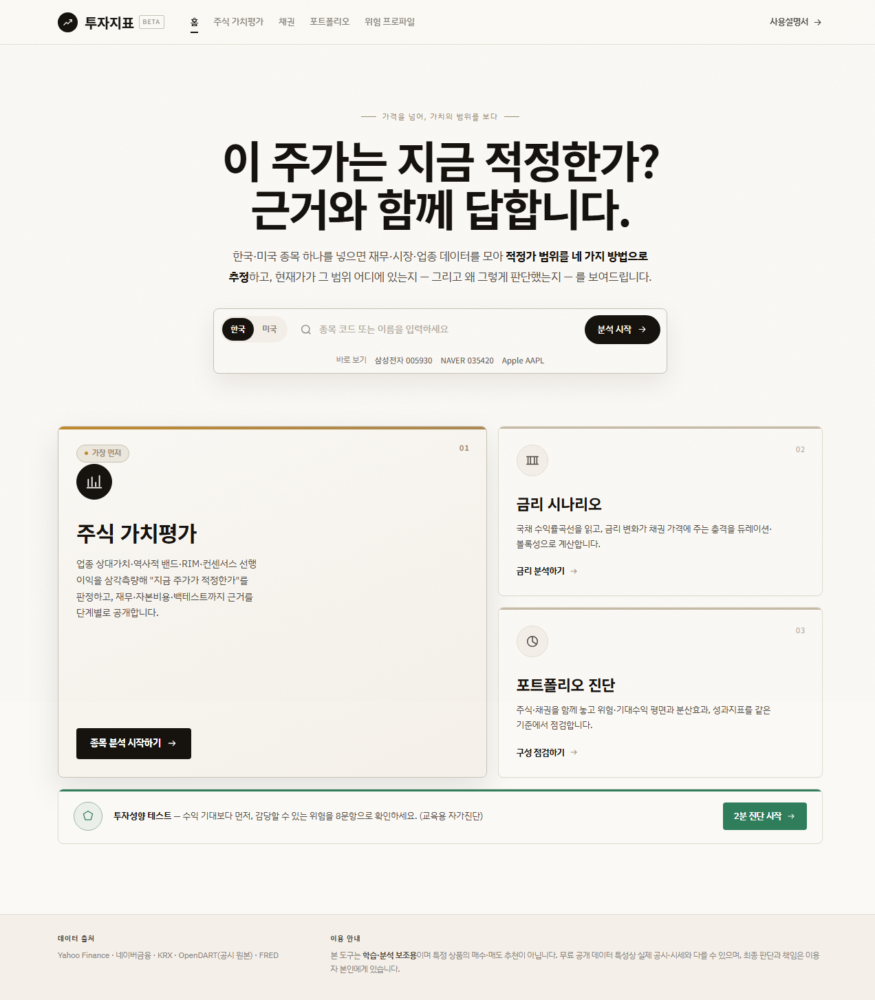
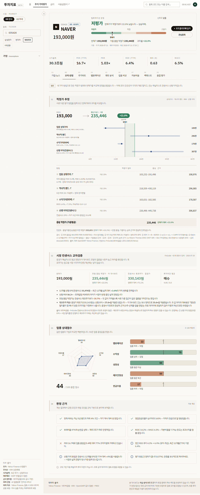
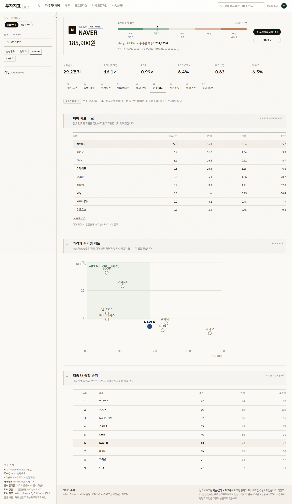
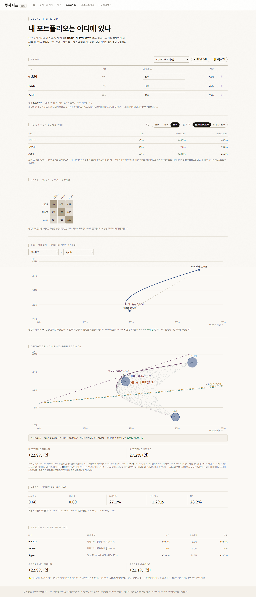
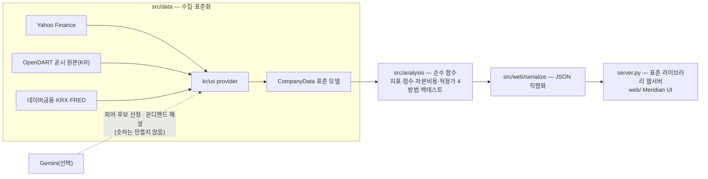

# 투자지표 — 기업 가치평가 대시보드

**"이 주가는 적정한가?"를 근거와 함께 보여주는 학습·분석용 리서치 도구**입니다.
종목 하나를 넣으면 재무·시장·업종 데이터를 모아 적정가 범위를 네 가지 방법으로 추정하고,
현재가가 그 범위 어디에 있는지 — 그리고 **왜 그렇게 판단했는지** — 를 화면에 그대로 공개합니다.
한국·미국 주식, 채권 금리위험, 포트폴리오 분산까지 한 흐름으로 이어집니다.
특정 종목의 매수·매도를 추천하는 서비스가 아닙니다.

이 프로젝트가 우선하는 기준은 세 가지입니다.

1. **검증 가능성** — 모든 수치에 산식·출처·기준일을 붙이고, 설계 결정은 ADR로 남깁니다.
2. **정직한 불확실성** — 결측·추정·표본 부족을 숨기지 않습니다. 계산을 생략하면 사유를 쓰고, 빈 값(—)에는 이유 말풍선을 답니다.
3. **통제된 AI** — AI(Gemini)는 피어 후보 선정과 온디맨드 해설만 담당하며, **화면의 숫자는 만들지 않습니다**. 모든 AI 출력에 면책을 붙이고, 키가 없으면 규칙 기반으로 폴백합니다.

## 화면

| 홈 | 주식 요약·판정 |
|---|---|
|  |  |
| **업종 비교 (피어 편집 가능)** | **포트폴리오 σ-기대수익 평면** |
|  |  |

## 빠른 실행

```bash
python -m venv .venv
# Windows: .venv\Scripts\activate   /  macOS·Linux: source .venv/bin/activate
pip install -r requirements.txt
python server.py
```

브라우저에서 `http://localhost:5178`을 엽니다. 첫 종목 조회는 피어 수집(병렬) 때문에 수 초~수십 초
걸리며 진행 상황(피어 수집 n/m)이 표시되고, 이후에는 캐시로 즉시 뜹니다. 기본 기능은 API 키 없이
동작하고, OpenDART 공시 원본과 Gemini 기능은 선택 키를 넣었을 때 켜집니다.

## 아키텍처



- 분석은 전부 **순수 함수**(입력=CompanyData) — 69개 단위·회귀 테스트가 CI(Quality 워크플로)에서 돕니다.
- 설계 결정은 [docs/adr/](docs/adr/)에 기록합니다 — 적정가 종합 방식, 백테스트 통계, 랭킹 가중치.

## 무엇을 보여주나

주식 가치평가는 9개 탭이 하나의 지표를 향해 조립됩니다 — 탭마다 상단에 "이 탭이
적정가 지표의 어느 부품인지" 역할 라벨이 붙어 있습니다.

| 탭 | 역할 | 내용 |
|---|---|---|
| ① 기업·뉴스 | 정성 맥락 | 기업 소개 + Google News 헤드라인(거시·산업·기업) + AI 뉴스분석(온디맨드) |
| ② 요약·판정 | **결론** | 적정가 4방법 가중 종합 vs 현재가, 방법별 가중·재정규화 공개, 신뢰도(방법 간 편차) 툴팁, 업종 상대점수, 규칙 기반 판정 근거 |
| ③ 주가차트 | 현재가 | 종가+이동평균+거래량, 52주 위치, 지수 대비 상대성과 |
| ④ 밸류에이션 | 적정가 재료 ② | 멀티플 7종 vs 업종·자기 5년 밴드, 비관/기준/낙관 시나리오·민감도 |
| ⑤ 재무 분석 | 적정가 재료 ③ | 성장·수익성·안정성·현금흐름(음수 영업현금흐름 자동 해설), 재무제표 원본 |
| ⑥ 업종 비교 | 적정가 재료 ① | 피어 지표·산점도·저평가 랭킹. **피어를 X로 빼고 ＋로 더해 재계산**(편집 내역은 화면에 명시) |
| ⑦ 자본비용 | 적정가 재료 ③ | 베타 회귀 → 하마다 → CAPM → WACC, ROIC 스프레드 |
| ⑧ 백테스트 | 사후 검증(②) | 역사적 밴드 신호의 과거 예측력 — 종합 판정 전체의 검증이 아님을 명시 |
| ⑨ 종합 평가 | 결론·AI 서술 | 계산 결과를 Gemini가 문장으로 종합(온디맨드, 면책 부착) |

함께 제공: **채권**(수익률곡선·듀레이션·볼록성 시나리오) · **포트폴리오**(σ-기대수익 평면·
효율적 프론티어·상관·세후 어림) · **위험 프로파일 자가진단**(교육용) · **사용설명서**.

## 방법론 요약

- **적정주가 4방법 가중 종합**: ① 업종 상대가치(피어 중앙값 멀티플) ② 역사적 밴드(자기 5년
  25~75분위) ③ 수익가치 RIM ④ 선행 이익(컨센서스 12M EPS × 자기 PER 중앙값).
  가중 ④35·①25·②25·③15%(Liu·Nissim·Thomas 2002의 가격 설명력 순위 반영), 없는 방법은
  제외 후 **재정규화**하고 실제 적용 가중을 표에 공개합니다.
- **판정**: 가중 종합 괴리율 5단계(±10%/±30%) + 방법 간 편차(변동계수)로 신뢰도 산출 — 근거를 툴팁으로 공개.
- **자본비용**: 5년 주간수익률 OLS 베타 → 하마다 언레버링 → CAPM → WACC.
- **점수화·랭킹**: 피어 백분위(0~100). 업종 순위는 가치 60·수익성 40 — 관례적 기본값임과
  민감도 확인 결과를 [ADR-0005](docs/adr/0005-peer-ranking-weights.md)에 문서화.
- **예외 처리**: 적자기업(PER·RIM 스킵), 금융업(EV/EBITDA·WACC 마스킹), 장부자본 왜곡(RIM 스킵),
  상장기간 부족(β=1 가정) — 전부 사유를 화면에 표시.

## 데이터 소스와 계보

| 데이터 | 한국 | 미국 |
|---|---|---|
| 연간 재무제표 (우선) | **OpenDART 공시 원본** (키 있을 때, ~6개년 연결) | — |
| 재무제표(보완)·주가 | yfinance | yfinance |
| 시총·상장목록·업종분류 | FinanceDataReader (KRX) | 위키피디아 S&P500 (GICS) |
| 참고 멀티플·컨센서스 | 네이버금융(FnGuide) | Yahoo Finance (LSEG I/B/E/S) |
| 뉴스 | Google News RSS (무키) | 좌동 |
| 금리 | 네이버 시장지표·FRED | 좌동 |

각 분석 응답은 실제 사용한 **출처를 항목별로 반환**하고, 화면 헤더에 주가 기준일·재무 연도·
계산 시각을 표시합니다. 캐시는 `data/cache/`(원천 12~24시간)와 서버 인메모리(분석 30분,
AI 6시간)에 저장됩니다.

**API 키 (선택, 무료)** — `.streamlit/secrets.toml` 또는 환경변수. 없어도 앱은 동작합니다.
- `OPENDART_API_KEY` — [opendart.fss.or.kr](https://opendart.fss.or.kr) · `GEMINI_API_KEY` — [aistudio.google.com](https://aistudio.google.com)
- 템플릿: [.streamlit/secrets.toml.example](.streamlit/secrets.toml.example) · 키는 `.gitignore`로 커밋에서 제외되며, 저장소 전체 이력에 키가 없음을 정기 점검합니다.

## 개발 검증

```bash
pip install -r requirements.txt -r requirements-dev.txt
python -m pyflakes app.py server.py src scripts tests
python -m unittest discover -s tests -v        # 69 tests
python scripts/check_bond.py && python scripts/check_portfolio.py
```

같은 검증이 PR·main 푸시마다 GitHub Actions `Quality` 워크플로로 돕니다.

## 폴더 구조

```
server.py                  정적 웹 + JSON API (표준 라이브러리만, 기본 127.0.0.1:5178)
web/                       Meridian UI — 홈·주식·채권·포트폴리오·위험 프로파일·설명서
src/data/                  수집·표준화 (providers, opendart, naver, news, gemini, cache, progress)
src/analysis/              순수 분석 함수 (indicators·scoring·capital_cost·valuation·backtest·commentary)
src/web/serialize.py       분석 결과 → 프런트 JSON
docs/adr/                  설계 결정 기록 (ADR)
docs/사용설명서.md          CPA 1차 눈높이 설명서
tests/                     69개 단위·회귀 테스트
app.py, src/ui/            [레거시] Streamlit 구버전
```

### Streamlit 구버전 안내

`app.py`(Streamlit, `:8501`)는 이 프로젝트의 **첫 구현으로, 레거시로 동결**되어 있습니다.
새 기능·디자인은 전부 웹 버전(`server.py`, `:5178`)에만 추가됩니다. 실행은 여전히
`streamlit run app.py`로 가능하지만 화면·수치는 웹 버전이 기준입니다.

## 한계 (알고 쓰기)

- 무료 공개 데이터라 결측·오차·기준일 불일치가 있습니다 — 화면에 그대로 표시하고 보완 출처를 밝힙니다.
- 한국 헤더 PER/ROE(TTM)는 yfinance 분기 합산이라 네이버 트레일링 값과 소폭 다를 수 있습니다(②탭에 참고치 병기).
- 백테스트는 **역사적 밴드(②) 신호 하나만** 검증합니다 — 종합 판정 전체의 성과 증거가 아닙니다.
- 포트폴리오 기대수익은 과거 59개월 실측 연율화라 **추정 오차가 큽니다** — σ·상관 중심으로 읽도록 안내합니다.
- 일부 보조 캡션의 명도 대비가 WCAG AA에 미달합니다(접근성 일괄 개선은 진행 예정 워크스트림).
- 위험 프로파일은 공식 투자자정보확인서를 대신하지 않는 교육용 자가진단입니다.
- 학습·분석 보조 도구이며 투자 조언이 아닙니다.

## 다음 단계 후보

- **회계 품질 신호**: 발생액 비율·Piotroski F-Score·Beneish M-Score·DART 감사의견 표시
- DART 분기 연동으로 TTM까지 공시 기준 정렬 · 전 시장 괴리율 스크리닝 · 간이 DCF
