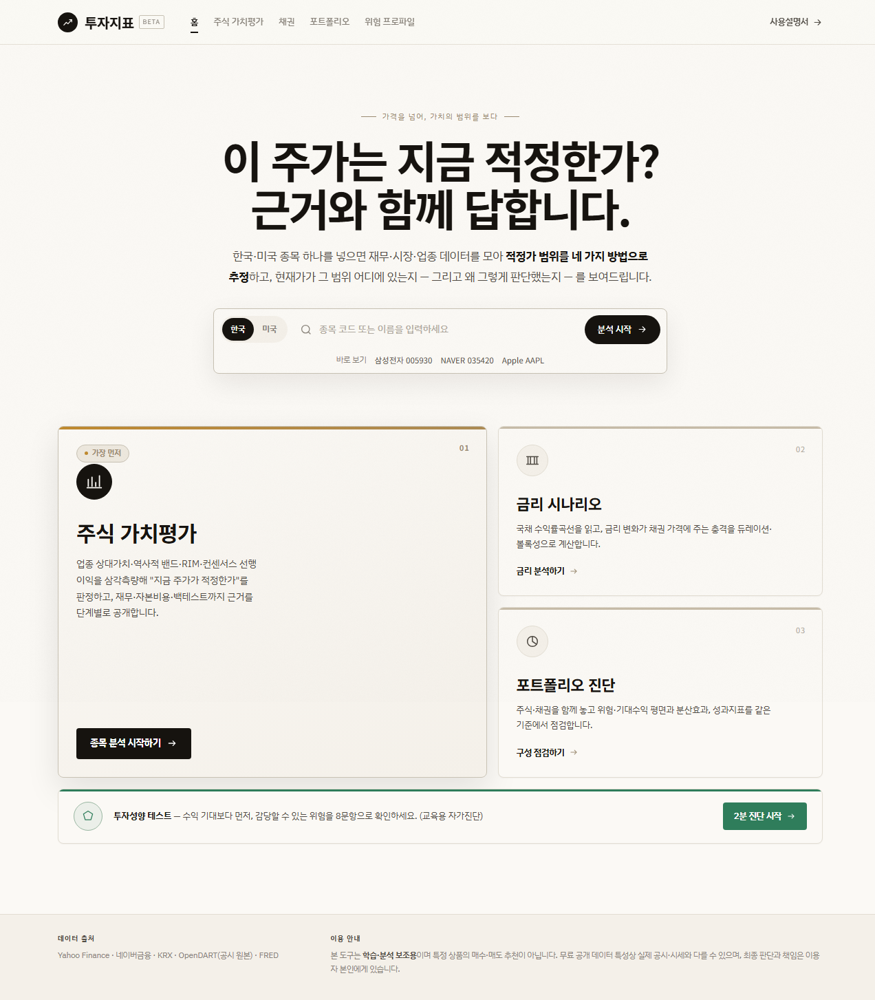
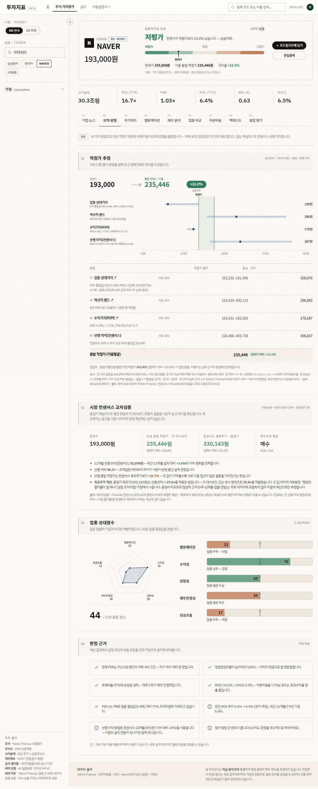
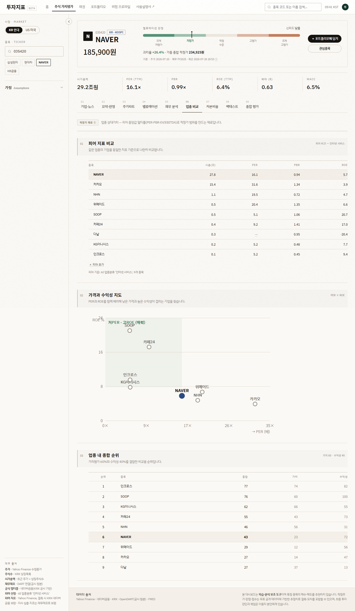
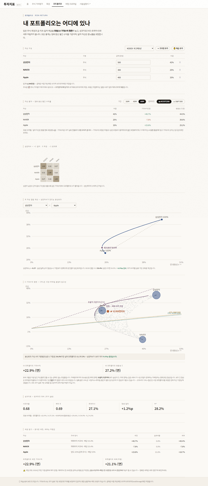
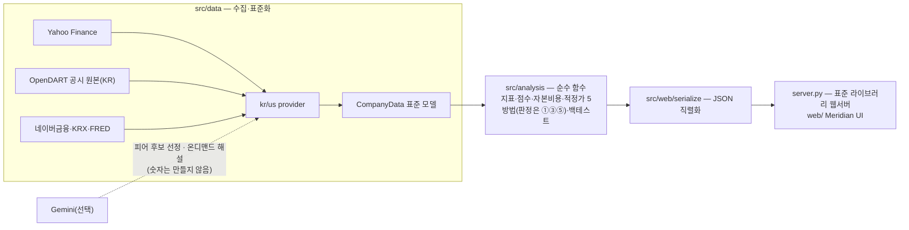

# 투자지표 — 기업 가치평가 대시보드

### 🔗 라이브 서비스 → **[valuation-dashboard.com](https://valuation-dashboard.com)**

**기본적 분석(재무·가치평가)에 기반해 "이 주가는 적정한가?"를 근거와 함께 보여주는
학습·분석용 투자지표 도구**입니다. 종목 하나를 넣으면 재무·시장·업종 데이터를 모아 적정가
범위를 **세 가지 방법**(①업종 상대가치 ③RIM ⑤정규화 이익)으로 추정하고 ④컨센서스 선행
이익은 판정에 넣지 않은 채 나란히 병기해, 현재가가 그 범위 어디에 있는지 — 그리고 **왜 그렇게
판단했는지** — 를 화면에 그대로 공개합니다. 한국·미국 주식, 채권 금리위험, 포트폴리오
분산까지 한 흐름으로 이어집니다. 특정 종목의 매수·매도를 추천하는 서비스가 아닙니다.

회계·재무 지식이 얕은 **일반 투자자**부터 지식이 있는 **투자자**까지를 대상으로 합니다.
같은 화면을 각자의 눈높이에서 읽을 수 있도록, 사용설명서를 **쉬운 설명**과 **전체 설명**
두 갈래로 풀어 제공합니다.

이 프로젝트가 우선하는 기준은 세 가지입니다.

1. **검증 가능성** — 모든 수치에 산식·출처·기준일을 붙이고, 설계 결정은 ADR로 남깁니다.
2. **정직한 불확실성** — 결측·추정·표본 부족을 숨기지 않습니다. 계산을 생략하면 사유를 쓰고, 빈 값(—)에는 이유 말풍선을 답니다.
3. **통제된 AI** — AI(Gemini)는 피어 후보 선정과 온디맨드 해설만 담당하며, **화면의 숫자는 만들지 않습니다**. 모든 AI 출력에 면책을 붙이고, 키가 없으면 규칙 기반으로 폴백합니다.

## 화면

| 홈 | 주식 요약·판정 |
|---|---|
|  |  |
| **업종 비교 (피어 편집 가능)** | **포트폴리오 σ-기대수익 평면** |
|  |  |

## 빠른 실행

```bash
python -m venv .venv
# Windows: .venv\Scripts\activate   /  macOS·Linux: source .venv/bin/activate
pip install -r requirements.txt
python server.py
```

브라우저에서 `http://localhost:5178`을 엽니다. 첫 종목 조회는 원천을 실제로 받아오느라 수 초
걸리고(진행 상황을 `자료 수집 n/7` → `피어 수집 n/m`으로 표시합니다), 이후에는 캐시로 즉시 뜹니다.
기본 기능은 API 키 없이 동작하고, OpenDART 공시 원본과 Gemini 기능은 선택 키를 넣었을 때 켜집니다.

> 로드 경로는 **서로 모르는 호출을 한 번에 띄웁니다**([ADR-0045](docs/adr/0045-parallelize-the-load-path.md)).
> 순수 계산은 실측 0.05초였고 나머지는 전부 네트워크 대기라, 그 대기를 겹쳤습니다 —
> 같은 종목·같은 캐시 상태에서 **4.22초 → 2.10초**(뉴스 캐시가 끊기면 5.68 → 2.98초).
> 재현: `python scripts/check_load_timing.py KR 005930`

## 아키텍처


```mermaid
flowchart LR
  subgraph DATA["src/data — 수집·표준화"]
    Y["Yahoo Finance"] --> P["kr/us provider"]
    O["OpenDART 공시 원본(KR)"] --> P
    N["네이버금융·KRX·FRED"] --> P
    P --> M["CompanyData 표준 모델"]
  end
  M --> A["src/analysis — 순수 함수<br/>지표·점수·자본비용·적정가 5방법(판정은 ①③⑤)·백테스트"]
  A --> S["src/web/serialize — JSON 직렬화"]
  S --> W["server.py — 표준 라이브러리 웹서버<br/>web/ Meridian UI"]
  G["Gemini(선택)"] -. "피어 후보 선정 · 온디맨드 해설<br/>(숫자는 만들지 않음)" .-> P
```

- 분석은 전부 **순수 함수**(입력=CompanyData) — 단위·회귀 테스트가 CI(Quality 워크플로)에서 돕니다 — 개수는 `pytest tests/ -q`가 말합니다.
- 설계 결정은 [docs/adr/](docs/adr/)에 기록합니다 — 적정가 종합 방식, 백테스트 통계, 랭킹 가중치.
- 개발 중 부딪힌 문제와 해결 과정은 [docs/TROUBLESHOOTING.md](docs/TROUBLESHOOTING.md)에 증상→원인→해결→교훈 형식으로 남깁니다.

## 무엇을 보여주나

주식 가치평가는 8개 탭이 하나의 지표를 향해 조립됩니다 — 탭마다 상단에 "이 탭이
적정가 지표의 어느 부품인지" 역할 라벨이 붙어 있습니다.

| 탭 | 역할 | 내용 |
|---|---|---|
| ① 기업·뉴스 | 정성 맥락 | 기업 소개 + Google News 헤드라인(거시·산업·기업) + AI 뉴스분석(온디맨드) |
| ② 요약·판정 | **결론** | 펀더멘털 적정가(**①③⑤** 가중 종합) vs 현재가 — 컨센서스 반영값(④ 포함)을 바로 옆에 병기, 방법별 가중·재정규화 공개, **‘근거 보기’ 접힘**(무엇에 기대는가 · 얼마나 틀리는가 · 가중치 폭 · 방법 간 편차), 업종 상대점수, 규칙 기반 판정 근거 |
| ③ 주가차트 | 현재가 | 종가+이동평균+거래량, 52주 위치, 지수 대비 상대성과 |
| ④ 밸류에이션 | 적정가 재료 ② | 멀티플 7종 vs 업종·자기 5년 밴드, 비관/기준/낙관 시나리오·민감도 |
| ⑤ 재무 분석 | 적정가 재료 ③ | 성장·수익성·안정성·현금흐름(음수 영업현금흐름 자동 해설), 재무제표 원본 |
| ⑥ 업종 비교 | 적정가 재료 ① | 피어 지표·산점도·저평가 랭킹. **피어를 X로 빼고 ＋로 더해 재계산**(편집 내역은 화면에 명시) |
| ⑦ 자본비용 | 적정가 재료 ③ | 베타 회귀 → 하마다 → CAPM → WACC, ROIC 스프레드 |
| ⑧ 종합 평가 | 결론·AI 서술 | 계산 결과를 Gemini가 문장으로 종합(온디맨드, 면책 부착) |
| ~~백테스트~~ | **무기한 보류** | 이 탭이 검증하던 것은 판정이 아니라 **② 역사적 밴드 하나**였고, ②는 그 뒤 판정에서 빠졌습니다(ADR-0035). 입구만 닫았고 코드는 그대로입니다(ADR-0009). **판정 자체의 사후검증은 따로 했습니다** — 아래 ‘한계’ 참조(ADR-0028·0029·0030) |

함께 제공: **채권**(수익률곡선·듀레이션·볼록성 시나리오) · **포트폴리오**(σ-기대수익 평면·
효율적 프론티어·상관·세후 어림) · **위험 프로파일 자가진단**(교육용) · **사용설명서**.

## 방법론 요약

- **적정주가 — 판정은 펀더멘털 3방법, 컨센서스는 병기**(ADR-0006):
  판정 = ① 업종 상대가치(업종·규모·수익성 **회귀**로 구한 적정 배수, ADR-0014)
  ③ 수익가치 RIM ⑤ 정규화 이익(8년 평균 순이익 × 그 회귀 적정 PER, ADR-0015·0025)
  의 가중평균(①38.5·③23.1·⑤38.5%). 셋 다 회사가 **이미 낸** 실적·자산에서 나온 값이라
  시장 기대와 독립적으로 계산됩니다.
  **② 역사적 밴드는 판정에서 뺐습니다**([ADR-0035](docs/adr/0035-drop-historical-band-from-the-verdict.md)) —
  넷 중 유일하게 논문 계보가 없었고 백테스트에서 단독 예측력이 확인되지 않았습니다.
  계산과 차트에는 그대로 남습니다.
  ④ 선행 이익(컨센서스 12M EPS × 자기 PER 중앙값)은 계산해서 **화면에 나란히 병기**하되
  판정에는 넣지 않습니다 — 시장 기대를 판정에 섞으면 "우리 판정이 시장을 얼마나 따라갔나"를
  볼 수 없게 되기 때문입니다. 두 값의 차이가 곧 **지금 주가에 실린 실적 기대분**입니다.
  가중 근거는 Liu·Nissim·Thomas 2002의 가격 설명력 순위. 없는 방법은 제외 후 **재정규화**하고
  실제 적용 가중을 표에 공개합니다.
- **판정**: 펀더멘털 종합 괴리율 **3등급** — 문턱은 로그 ±0.897로, ①에 쓴 배수의 실측 오차에서
  가져왔습니다([ADR-0042](docs/adr/0042-verdict-thresholds-what-passed-was-selectivity.md)).
  방법 간 편차·가중치 폭·이 판정이 무엇에 기대는지는 **‘근거 보기’ 접힘**에서 공개합니다.
  **‘신뢰도’ 등급은 뗐습니다**([ADR-0043](docs/adr/0043-the-confidence-badge-did-not-do-what-it-claimed.md)) —
  등급이 주장하는 것을 하지 못했습니다(한국 ‘높음’ 0건 · 미국 100% ‘낮음’).
- **자본비용**: 5년 주간수익률 OLS 베타 → 하마다 언레버링 → CAPM → WACC.
- **점수화·랭킹**: 피어 백분위(0~100). 업종 순위는 가치 60·수익성 40 — 관례적 기본값임과
  민감도 확인 결과를 [ADR-0005](docs/adr/0005-peer-ranking-weights.md)에 문서화.
- **예외 처리**: 적자기업(PER·RIM 스킵), 금융업(EV/EBITDA·WACC 마스킹), 장부자본 왜곡(RIM 스킵),
  상장기간 부족(β=1 가정) — 전부 사유를 화면에 표시.

## 데이터 소스와 계보

**공개 출처만 씁니다.** 사설 데이터 벤더를 쓰면 화면의 숫자를 제3자가 검증할 수 없기
때문입니다 — 위 원칙 1(검증 가능성)의 실행입니다. 우선순위는 **공시 원본 → 거래소 공식
집계 → 시장 데이터 제공자** 순이고, 항목마다 실제로 쓴 출처를 응답과 화면에 그대로 밝힙니다.

| 데이터 | 한국 | 미국 |
|---|---|---|
| 연간 재무제표 (우선) | **OpenDART 공시 원본** (키 있을 때, ~6개년 연결) | — |
| 재무제표(보완)·주가 | yfinance | yfinance |
| 시총·상장목록·업종분류 | FinanceDataReader (KRX) | 위키피디아 S&P500 (GICS) |
| 참고 멀티플·컨센서스 | 네이버금융(FnGuide) | Yahoo Finance (LSEG I/B/E/S) |
| 뉴스 | Google News RSS (무키) | 좌동 |
| 금리 | 네이버 시장지표·FRED | 좌동 |

각 분석 응답은 실제 사용한 **출처를 항목별로 반환**하고, 화면 헤더에 주가 기준일·재무 연도·
계산 시각을 표시합니다. 캐시는 `data/cache/`(원천 12~24시간)와 서버 인메모리(분석 30분,
AI 6시간)에 저장됩니다.

**API 키는 선택 사항입니다** — 없어도 전 기능이 동작하며, OpenDART 공시 원본과 Gemini 해설만
켜집니다. `.streamlit/secrets.toml` 또는 환경변수로 읽습니다(두 곳 다 발급은 무상입니다).
- `OPENDART_API_KEY` — [opendart.fss.or.kr](https://opendart.fss.or.kr) · `GEMINI_API_KEY` — [aistudio.google.com](https://aistudio.google.com)
- 템플릿: [.streamlit/secrets.toml.example](.streamlit/secrets.toml.example) · 키는 `.gitignore`로 커밋에서 제외되며, 저장소 전체 이력에 키가 없음을 정기 점검합니다.

## 개발 검증

```bash
pip install -r requirements.txt -r requirements-dev.txt
python -m pyflakes app.py server.py src scripts tests
python -m pytest tests/ -q                     # 단위·회귀 테스트
python scripts/check_all.py                    # CI 관문 전부 (커밋·PR 전 필수)
python scripts/check_bond.py && python scripts/check_portfolio.py
```

같은 검증이 PR·main 푸시마다 GitHub Actions `Quality` 워크플로로 돕니다.

**네트워크가 필요한 진단은 CI에 없습니다** — 따로 돌립니다.

```bash
python scripts/check_analysis.py KR 005930     # 실제 종목에서 판정·근거 확인
python scripts/check_sector_label.py --live 005930 000660   # 회귀가 거래소 라벨을 쓰는가 (ADR-0044)
python scripts/check_load_timing.py KR 005930  # 첫 조회가 어디서 시간을 쓰는가 (ADR-0045)
python scripts/check_payload_parity.py save KR 005930       # 고치기 전에 골든을 뜬다
python scripts/check_payload_parity.py compare KR 005930    # 고친 뒤 페이로드가 그대로인가
```

마지막 둘은 **성능을 고칠 때 쓰는 짝**입니다. 빨라진 것은 초시계가 말해 주지만 조용히
달라진 값은 아무도 말해 주지 않으므로, **바꾸기 전에** 골든을 뜨고 나중에 대조합니다.

## 운영

라이브 서비스는 **Render**(파이썬 백엔드)와 **Cloudflare**(도메인·SSL)로 돌아갑니다.
`/api/*`가 살아 있어야 하므로 정적 호스팅으로는 동작하지 않고, 리포에 배포 청사진
(`render.yaml`)이 포함돼 있습니다.

**서버는 기동 직후 캐시를 스스로 채웁니다** — Render의 파일시스템이 휘발성이라 배포마다
캐시가 비는데, 예열이 없으면 그 시간을 방문자가 냅니다. 실측 **12.33초 → 2.46초**
([ADR-0048](docs/adr/0048-warm-the-showcase-on-boot-not-a-disk.md)).
업종 회귀 계수는 **밤에 CI가 미리 구워** 별도 브랜치에 두고, 그 빌드가 실패해도
**이전 계수를 파괴하지 않고 이어받습니다**([ADR-0049](docs/adr/0049-the-build-must-not-destroy-what-it-could-not-rebuild.md)).

절차와 운영 주의사항은 [docs/DEPLOY.md](docs/DEPLOY.md)에 있습니다.

## 폴더 구조

```
server.py                  정적 웹 + JSON API (표준 라이브러리만, 기본 127.0.0.1:5178)
web/                       Meridian UI — 홈·주식·채권·포트폴리오·위험 프로파일·설명서
src/data/                  수집·표준화 (providers, opendart, naver, news, gemini, cache, progress, parallel)
src/analysis/              순수 분석 함수 (indicators·scoring·capital_cost·valuation·backtest·commentary)
src/web/serialize.py       분석 결과 → 프런트 JSON
src/web/prewarm.py         기동·수동 프리워밍 목록과 동작 (한 벌만 존재)
docs/adr/                  설계 결정 기록 (ADR)
docs/TROUBLESHOOTING.md     트러블슈팅 로그 (증상→원인→해결→교훈)
docs/사용설명서.md          CPA 1차 눈높이 설명서
tests/                     단위·회귀 테스트
app.py, src/ui/            [레거시] Streamlit 구버전
```

### Streamlit 구버전 안내

`app.py`(Streamlit, `:8501`)는 이 프로젝트의 **첫 구현으로, 레거시로 동결**되어 있습니다.
새 기능·디자인은 전부 웹 버전(`server.py`, `:5178`)에만 추가됩니다. 실행은 여전히
`streamlit run app.py`로 가능하지만 화면·수치는 웹 버전이 기준입니다.

## 한계 (알고 쓰기)

- 무료 공개 데이터라 결측·오차·기준일 불일치가 있습니다 — 화면에 그대로 표시하고 보완 출처를 밝힙니다.
- 한국 헤더 PER/ROE(TTM)는 yfinance 분기 합산이라 네이버 트레일링 값과 소폭 다를 수 있습니다(②탭에 참고치 병기).
- **판정을 사후검증했습니다 — 한국에서만 확인됐습니다.** 한국 1,292종목(폐지 332곳 포함) ·
  9개 시점(2017~2025)에서 판정에 예측력이 있었고([ADR-0028](docs/adr/0028-backtest-the-verdict-has-predictive-power.md)),
  **미국 같은 기간에서는 확인되지 않았습니다**([ADR-0030](docs/adr/0030-us-does-not-replicate.md) · H1 t=0.92).
  화면에도 이보다 강한 말을 쓰지 않습니다. 12개월은 이 도구의 주장에 맞는 자가 아니었다는 것도
  함께 나왔습니다([ADR-0029](docs/adr/0029-one-year-was-the-wrong-ruler.md)).
  <br/>※ ADR-0009가 *"무료 데이터 길이로는 정렬이 불가능하다"*고 적었던 벽 셋은 **셋 다 우리
  쿼리의 한계**였습니다(주가 `period="5y"` 기본값 · 재무 보고서 2개만 수신 · 시점별 유니버스는
  `KRX-DELISTING`으로 복원). **화면의 백테스트 탭은 여전히 닫아 둡니다** — 그 탭이 검증하던
  것은 판정이 아니라 ② 하나였고, ②는 그 뒤 판정에서 빠졌습니다(ADR-0035).
- 포트폴리오 기대수익은 과거 59개월 실측 연율화라 **추정 오차가 큽니다** — σ·상관 중심으로 읽도록 안내합니다.
- 일부 보조 캡션의 명도 대비가 WCAG AA에 미달합니다(접근성 일괄 개선은 진행 예정 워크스트림).
- 위험 프로파일은 공식 투자자정보확인서를 대신하지 않는 교육용 자가진단입니다.
- 학습·분석 보조 도구이며 투자 조언이 아닙니다.

